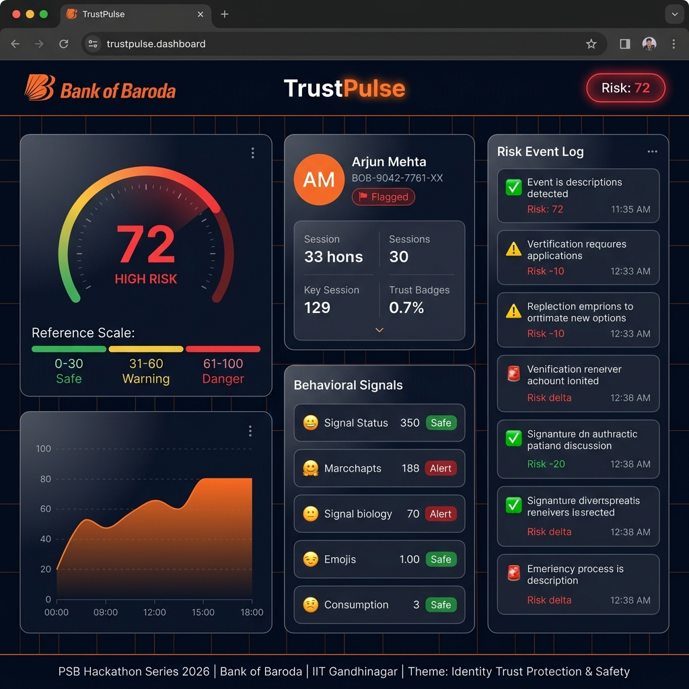
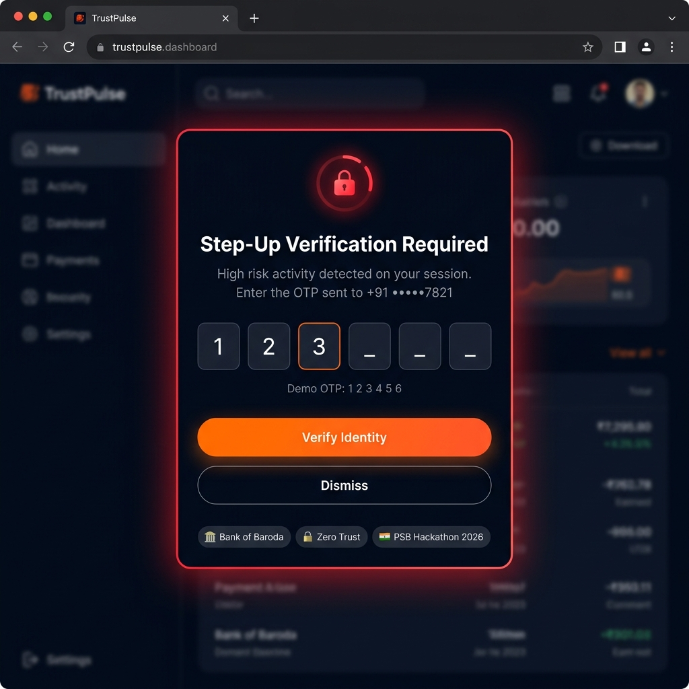

<div align="center">

# 🔐 TrustPulse
### Real-Time Identity Trust & Risk Scoring Dashboard

[](https://github.com/smit208/trustpulse)
[](https://www.bankofbaroda.in)
[](https://iitgn.ac.in)
[](https://financialservices.gov.in)
[](https://react.dev)
[](https://vite.dev)

---

**PSB Hackathon Series 2026 — Cybersecurity & Fraud Domain**  
*Theme: **Identity Trust, Protection & Safety***  
*Organized under the guidance of Department of Financial Services (DFS), Ministry of Finance, Government of India*

</div>

---

## 📸 Screenshots

### 🎯 Live Risk Score Dashboard


### 🔐 Step-Up Authentication Modal


---

## 🎯 What is TrustPulse?

**TrustPulse** is a real-time **Identity Trust & Risk Scoring** dashboard that implements **Zero Trust Architecture** principles for digital banking security. It continuously analyzes behavioral signals, device fingerprints, and transactional patterns to compute a dynamic risk score for every user session — enabling intelligent, context-aware security responses.

> *"Never trust, always verify"* — Zero Trust Security Model

---

## ✨ Features

| Feature | Description |
|---|---|
| 🎯 **Live Risk Gauge** | Real-time radial meter (0–100) with color-coded risk zones — Green / Yellow / Red |
| 📈 **Risk Timeline Chart** | 30-point area chart showing risk score history with orange BOB-branded gradient |
| 🧬 **Behavioral Signals Panel** | 5 live AI-simulated signals: Typing Behaviour, Device Fingerprint, Login Location, Transaction Pattern, Session Duration |
| 📋 **Risk Event Log** | Scrolling live feed of security events with risk delta indicators (+/−) |
| 🔐 **Step-Up Auth Trigger** | Automatic OTP popup when risk score crosses **70** — simulates FIDO2 / MFA step-up |
| 🛡️ **Trust Profile Card** | User card with dynamic trust level: **Trusted / Under Review / Flagged** |

---

## 🏗️ Tech Stack

```
Frontend:    React 18 + Vite 8
Styling:     Vanilla CSS (custom design system, dark theme)
Charts:      Recharts (RadialBarChart, AreaChart)
Fonts:       Inter + JetBrains Mono (Google Fonts)
Simulation:  Frontend-only, no backend required
```

---

## 🚀 Run Locally

```bash
# Clone the repository
git clone https://github.com/smit208/trustpulse.git
cd trustpulse

# Install dependencies
npm install

# Start development server
npm run dev
```

Open **http://localhost:5174** in your browser.

---

## 🔒 Zero Trust Concepts Implemented

```
┌─────────────────────────────────────────────────┐
│              Zero Trust Pillars                  │
├─────────────────┬───────────────────────────────┤
│ Identity        │ Continuous trust scoring       │
│ Devices         │ Fingerprint verification       │
│ Networks        │ Location anomaly detection     │
│ Applications    │ Session behaviour analytics    │
│ Data            │ Transaction pattern analysis   │
└─────────────────┴───────────────────────────────┘
```

### Risk Score Calculation
| Score Range | Risk Level | Action |
|---|---|---|
| 0 – 30 | 🟢 **Safe** | Normal session — no intervention |
| 31 – 60 | 🟡 **Warning** | Monitoring intensified |
| 61 – 100 | 🔴 **High Risk** | Step-up authentication triggered |

### Behavioral Signals
- **Typing Behaviour** — Keystroke dynamics analysis (rhythm, cadence, WPM)
- **Device Fingerprint** — Browser/device hash vs trusted device registry
- **Login Location** — Geolocation vs historical login patterns
- **Transaction Pattern** — Amount, frequency, beneficiary anomaly detection
- **Session Duration** — Idle time + active time behavioral baseline

---

## 🔐 Step-Up Authentication Flow

```
User Session Started
       │
       ▼
Risk Score Computed Continuously (every 2.5s)
       │
   Score > 70?
       │
    ┌──┴──┐
   Yes    No
    │      │
    ▼      ▼
 OTP    Continue
 Modal  Session
    │
    ▼
 Verified? ──Yes──► Risk Normalised (−40 points)
    │
    No
    │
    ▼
 Retry / Escalate
```

> **Demo OTP:** `1 2 3 4 5 6`

---

## 📁 Project Structure

```
trustpulse/
├── public/
├── screenshots/
│   ├── dashboard.png         # Main dashboard UI
│   └── otp-modal.png         # Step-up auth modal
├── src/
│   ├── App.jsx               # Main component (all features)
│   ├── App.css               # Full design system & animations
│   ├── main.jsx              # React entry point
│   └── index.css             # Base reset
├── index.html                # HTML shell with SEO meta tags
├── vite.config.js
├── package.json
└── README.md
```

---

## 🎨 Design System

| Token | Value | Usage |
|---|---|---|
| `--bob-orange` | `#f97316` | Primary accent — BOB brand |
| `--bg-base` | `#020817` | Page background |
| `--bg-surface` | `#0f172a` | Panel background |
| `--safe` | `#22c55e` | Low risk indicators |
| `--warn` | `#f59e0b` | Medium risk indicators |
| `--danger` | `#ef4444` | High risk indicators |

---

## 🏆 Hackathon Context

| Field | Details |
|---|---|
| **Event** | PSB Hackathon Series 2026 |
| **Domain** | Cybersecurity & Fraud |
| **Theme** | Identity Trust, Protection & Safety |
| **Host** | Bank of Baroda |
| **Academic Partner** | IIT Gandhinagar (IITGN) |
| **Guidance** | Department of Financial Services (DFS), Ministry of Finance, GoI |

---

## 👨‍💻 Built With ❤️ for PSB Hackathon 2026

<div align="center">

🏦 **Bank of Baroda** × ⚡ **IIT Gandhinagar** × 🇮🇳 **DFS, Ministry of Finance**

*Zero Trust Security for the future of Digital India*

</div>
